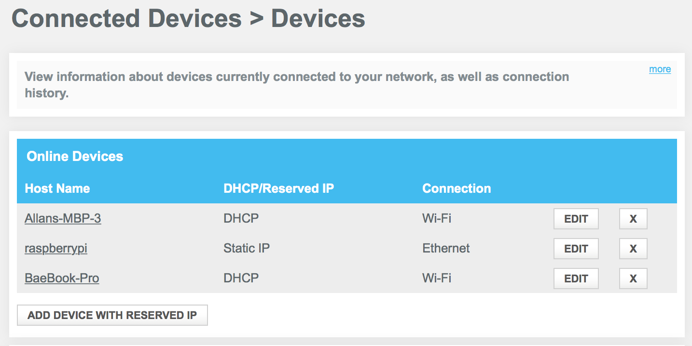
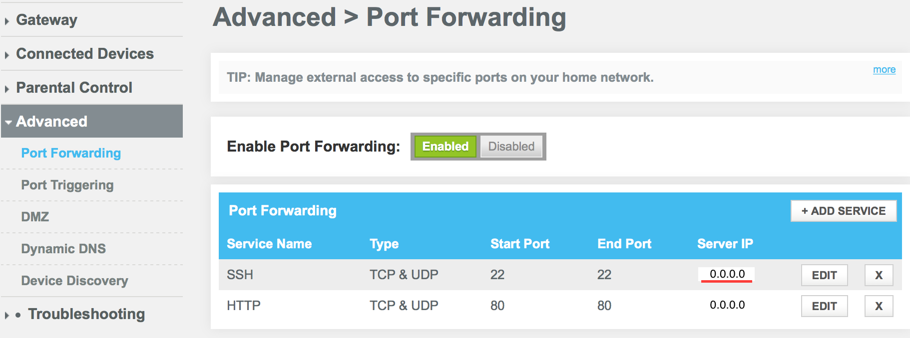

###How to SSH on your Raspberry Pi

#####Objectives
1. Use that Raspberry Pi (RPi) you have collecting dust!
2. Learn how to use SSH on OSX
3. Explore some basic networking

Note: The Raspberry Pi Foundation has done a great job
<a href="https://www.raspberrypi.org/documentation/remote-access/">documenting</a> how to login remotely to your little princess...but for the sake of being thorough

####SSH connection on your local network

If your RPi is up and running it should have an IP address by this point (if connected to the internet). We will need  in order to connect over the LAN to your RPi.

We can check the IP one of two ways:

1. Via the command line inside your RPi
2. Checking your router admin page for connected devices - then grab the Raspberry Pi address from there

##### Raspberry Pi Command line:

```
$ ifconfig
```

</img>
<br/><br/>

##### Local router:

</img>

Click on your Raspberry Pi which will then display the IP address

<br/>

```
#Your local IP address => 0.0.0.0

$ ssh pi@0.0.0.0
```

With this command you should be able to logging into you RPi terminal like a pro

Alright you are some hot stuff logging in remotely to your RPi... Now how would you do that when you are not in the LAN?
<br/>

####SSH connection from anywhere
The RPi Foundation suggests: <a href="https://www.raspberrypi.org/documentation/remote-access/access-over-Internet/internetaccess.md">weaved</a>

I have nothing against weaved but one of our objectives is to experience some basic networking so this tutorial will do it the manual way

</img>

If you just said what on earth is a "Port Forwarding" check out this <a href="http://superuser.com/questions/284051/what-is-port-forwarding-and-what-is-it-used-for  ">post</a>
<br/>

1. Bring up your admin page for your local router again and you should see an option for "Port Forwarding" select this option.

2. Once on the Port Forwarding page we want to add a new item with a type TCP/UDP and enable it for port forwarding

3. The RPi and other computers listen on port 22 for incoming SSH requests. So should use port 22 in the port category of our newly created item

4. Then enter in the RPi IP address we found earlier and start the port forwarding

```
#Your router IP address => 0.0.0.0

$ ssh pi@0.0.0.0
```

With this command you should be able to log into your RPi terminal from anywhere with an internet connection. If you aren't sure what your router IP address check this [site](http://www.myipaddress.com/show-my-ip-address/) out

You could even test this out from your local network!

####Dynamic IP address

If we expect our RPi to be at the same local IP address whenever we SSH we may need to do a bit more work

Since modern routers will dynamically change local IP addresses our port forwarding may end up pointing to the wrong device or nothing at all

This can be solved either through your router interface or [manually](http://elinux.org/RPi_Setting_up_a_static_IP_in_Debian) by setting your Raspberry Pi to a static IP address

Once your Raspberry Pi's dynamic host configuration protocol (DHCP) is disabled you should be clear for launch!
