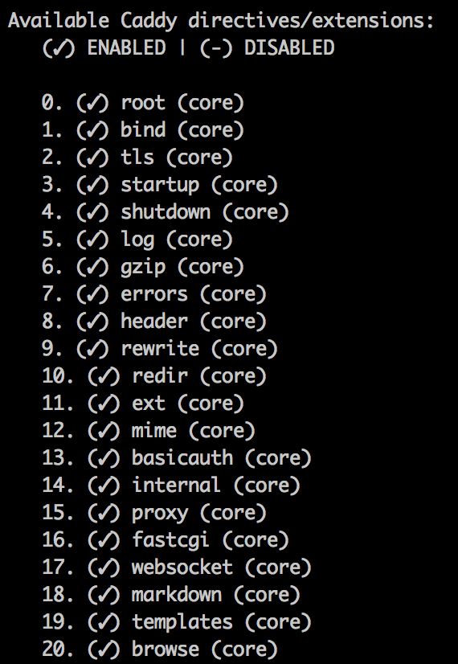

### Introduction to using Caddy extensions

##### Objectives
1. Add features to your Caddy server
2. Check out the Caddy docs

#### What are Caddy configurations?

Just like any server Caddy has different settings or features that can be accessed via its configuration

Examples of cool features you can add on to your Caddy server:

1. Markdown - Serve up .md right out of the box
2. Github - Allow for your server to pull from a specified repository from time to time allowing for a simple deploy
3. Templates - Create layouts for your static site to allow for less code duplication
4. Ext - Allow your paths to omit the file extension like `.html, .md, .pdf`
5. [Lots more](https://caddyserver.com/docs)

I use the directives mentioned above in my Caddyfile for www.amaxwellblair.com

```
http://www.amaxwellblair.com {
        root public_html/
        gzip
        ext .html .md
        templates
        markdown /posts/ {
                template post /templates/posts/post.html
        }
        git https://github.com/amaxwellblair/blog.git
}
```

Running this on the shipped version of Caddy will probably throw an error. This is because the `git` directive is an extension

Since Caddy is open source other developers have contributed to Caddy. Some of the contributions have come in the form of extensions which are separate from the initial Caddy installation

#### How to use Caddy extensions

In order to use Caddy extensions you will need to compile your own version of Caddy with the extensions included. This may seem intimidating but we can handle this in a few short tasks.

Install `caddyext` using `go get`

```
$ go get  -u github.com/caddyserver/caddyext
```

Checkout the docs [here](https://github.com/caddyserver/caddyext)

With `caddyext` installed we can now check out which directives are included by using the command `caddyext stack`

</img>

`(core)` represents directives that are standard to Caddy

Next we can install a specific extension. Let's install the git extension

```
$ caddyext install git
```

If we run `caddyext stack` again we should see

```
21. (✓) git
```

Now that the git extension has been installed we can build a binary for our custom list of directives. When we build the binary it will output the file to your current directory

Since `go/bin` is already in your `PATH` and you keep your other Golang binaries in this directory it would be a good choice for your build

```
$ cd $GOPATH/bin
$ caddyext build
```

You should have a new binary called customCaddy

This new custom binary can be used just like `caddy`. So when you are in your app directory with a Caddyfile you `customCaddy` will start up your webserver including the extensions enabled.

Is your server already live on :80 or :443? You probably need to give permission to the new binary `customCaddy`

```
$ cd $GOPATH/bin
$ setcap cap_net_bind_service=+ep ./customCaddy
```

Now that you have the git directive installed you should be able to run `git https://github.com/my_name/my_repo` in your Caddyfile
