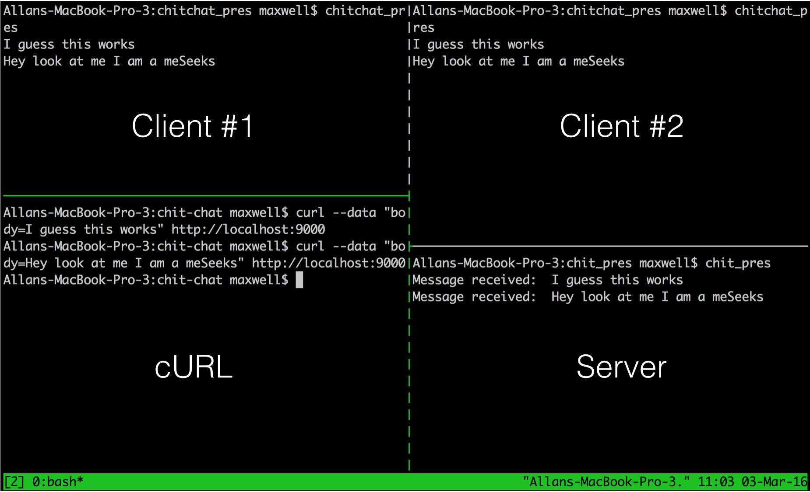
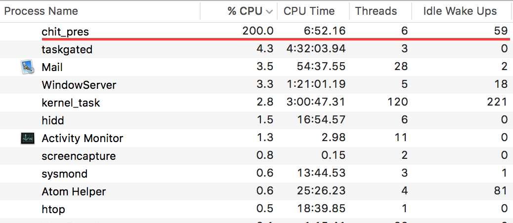
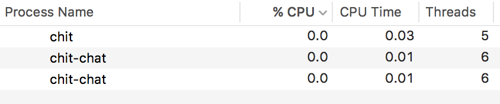

###  Make a chat app using Go
A chat application is a great way to learn about concurrency and in this particular
case parallelism. As an avid fan of Go and [DigitalOcean's](https://www.digitalocean.com/)
awesome product I decided to create "chit-chat" a command line chat application
using a droplet and ~100 LOC. So far the "chit" server has hosted up to 6-7 clients.
 Will be back with more results.

As a junior developer and student I still have a lot of learning to do. If you
have any comments please send me an email at the address located within the
footer.

##### Objectives
1. Explore some basic HTTP
2. Learn about concurrency and perhaps some parallelism
3. Code some Go!

If you want to immediately get ankle deep in code just check out [chit-chat](https://github.com/amaxwellblair/chit)

##### Getting started
Install [Go](https://golang.org/doc/install) if you have not

Basic understanding of programming and Go

It would be helpful to have some knowledge of HTTP and [concurrency](https://ghcmutterings.wordpress.com/2009/10/06/parallelism-concurrency/)
before starting

Somewhere to place your server (like a Raspberry Pi or a DigitalOcean droplet)
would be nice, but this isn't necessary

#### How do we create a chat room?
Let's think about how a primitive chat room works:

1. Clients connect to the chat room
2. A client posts a message to the chat room
3. Chat room broadcasts message to all connected clients
4. Rinse and repeat

#### How do you send messages to the chat room?
A simple POST request is an easy way to send data via HTTP. Why not just use
 cURL (client for URLs)?

```
$ curl --data "body=Hello world!" http://localhost:9000
```

This is a great way to test your server and for a [MVP](https://en.wikipedia.org/wiki/Minimum_viable_product)
 this is good enough for now.

#### How do we create our chat room?
A chat room is simply a service that broadcasts a message to all of those connected
to the room. We can use a basic server to implement this functionality.

Go has a robust HTTP package that allows for simple and straight
 forward server setup. To quickly get up and running try:

```
package main

import (
  "net/http"
)

func main() {
    http.ListenAndServe(":9000", nil)
}
```

Use your favorite browser and enter: `localhost:9000`. You should see a
404 error sent back to you from your server. Way to go!

OK lets set up specific endpoints:

```
package main

import (
  "fmt"
  "net/http"
)

// rootHandler receives messages
func rootHandler(w http.ResponseWriter, r *http.Request) {
	body := r.FormValue("body")
	fmt.Println("Message received: ", body)
}

func main() {
    http.HandleFunc("/", rootHandler)
    http.ListenAndServe(":9000", nil)
}
```

With the inclusion of `rootHandler` our server will now respond to requests sent
 at the "/" path. Our simplistic handler will be looking for requests that have
"body" as a parameter. The server will then print the body to
[stdout](https://en.wikipedia.org/wiki/Standard_streams).

If you start your server on localhost and in a separate terminal session send a
few cUrls you should be able to see the "body" on your server terminal.

Hopefully you are beginning to have an idea of how the server receives a
message.

Now that the message is somewhere on our server. How do we broadcast that to our
 clients?

More importantly, how do clients even connect to the chat room? Unfortunately a
server can not directly connect to specific clients behind a router with out
[port forwarding](http://superuser.com/questions/284051/what-is-port-forwarding-and-what-is-it-used-for).

It would be much too onerous to ask our clients to embark on port forwarding so
we need another solution. One implementation is called long polling.

Long polling is the act of initiating a connection client side and waiting till
 information changes on server side for a response to be sent. Take a look at
this [post](http://dsheiko.com/weblog/websockets-vs-sse-vs-long-polling/) for a
 good diagram.

```
import (
	"fmt"
	"net/http"
	"time"
)

var x bool
var body string

// rootHandler receives messages
func rootHandler(w http.ResponseWriter, r *http.Request) {
	body = r.FormValue("body")
	x = true
	fmt.Println("Message received: ", body)
}

// chatHandler sends messages to clients connected to the chat room
func chatHandler(w http.ResponseWriter, r *http.Request) {
	x = false
	for x == false {
		// Wait until we have a message (long polling)
	}
  // Then send the message in the response
	fmt.Fprintf(w, body)
}

func main() {
	http.HandleFunc("/", rootHandler)
	http.HandleFunc("/chat", chatHandler)
	http.ListenAndServe(":9000", nil)
}
```

Our `chatHandler` is a good example of a simple long poll. The `chatHandler` will
force the client to wait until the `body` is changed by `rootHandler`.

Thus every client connected to the chatroom will be waiting for a response. Once
 a message is sent to the chatroom the server will respond to each client
connected. Once a client receives the message it will send another `GET` request
to sync back up with the `chatHandler`. This process will repeat until a
client leaves the chatroom. Allowing for a consistent connection.

Although our long polling method is missing something. For example how does the
server deal with multiple `chatHandler` connections and serving up requests on
our "/" path all at the same time?

Concurrency.

Fortunately Go's `net/http` package has concurrency built in using go
routines. So our current implementation using a `for` loop will kind of work, but let's cross that
bridge later on in the post.

#### How do we receive messages from the chat room?

Our client will send a `GET` request to the server and initiate the long poll.
Once connected it will wait for a response. When a response is finally sent it
will print to your terminal and issue another `GET` request. The spice must
flow.

We will create our client in a separate file. Since we will also want to execute
 this code we need to put it in a separate directory. Check out my file
structure [here](https://github.com/amaxwellblair/chit) for further
clarification.

Check out a simple implementation below:
```
package main

import (
	"fmt"
	"io/ioutil"
	"net/http"
)

// Client gets messages from server
func Client() {
	for {
    // long polling is initiated
		response, err := http.Get("http://localhost:9000/chat")  
		defer response.Body.Close()
		if err != nil {
			fmt.Println(err.Error())
		}

		bs, err := ioutil.ReadAll(response.Body)
		if string(bs) != "" {
			tr := string(bs)
      // print to terminal
			fmt.Println(tr)
		}
	}
}
```

#### Testing out our chat application

*NOTE: If your computer doesn't have multiple CPUs this will not work. Don't
 worry we will fix this later*


With this code implemented we can test our application.

Run your server and client in separate tabs then begin cURLing your server. You
 can use the cURL `POST` request we created earlier.

Your client should be receiving messages from the server which contain your
cURL body parameters. It should print these to the client prompt.

Take a look at an example of what success looks like:



1. The server receives messages from our cURL and sends them to both clients
2. Client \#1 & \#2 are both connected to the server and receive the messages sent by cURL
3. Our cURLs are being sent straight from the terminal

#### Wait...are we parallel?

If you were running multiple client's like in my setup example your activity
monitor should look something like this:



This raises the question:

*Why are we using 2 CPUs?*

and...

*What is hidd? (more of a personal question :)*

It doesn't seem that our application is just concurrent. For every client
connected a CPU is added. So therefor we are also employing parallel processes.

Pretty cool Go's http package can do this all on its own, but what happens
when we have only one CPU?

#### Blocking

In a nut shell the client waiting for a response will block the other processes
on the server. This will prevent messages from being sent and received. So the
only way Go can manage this process is using another CPU.

Well where is the problem?

```
// chatHandler sends messages to clients connected to the chat room
func chatHandler(w http.ResponseWriter, r *http.Request) {
	x = false
	for x == false {
		// Wait until we have a message (long polling)
	}
  // Then send the message in the response
	fmt.Fprintf(w, body)
}
```
The main culprit is our hungry `for` loop. Since our sole CPU is working on
this loop it will never be able to feed the `for` loop AND serve a request to
the `rootHandler` at the same time. So if it can't serve the `rootHandler` our
 `chatHandler` will stay in an infinite loop and blow up our server.

We can unblock our server using `time.Sleep`. This will sleep the process so
other processes can operate. Now when the `chatHandler` receives a
 connection our `for` loop will sleep for 100 millisecond intervals. During these
intervals `rootHandler` can serve requests and release `chatHandler` from its
infinite loop.

```
for x == false {
  // Wait until we have a message (long polling)
  time.Sleep(100 * time.Millisecond)
}
```
*Don't forget to include "time" as an import*

Once `time.Sleep` is implemented you have created a concurrent command line chat
 application! Now when you run your server you should be able to handle multiple
  requests and connections with ease.

Let's see what happens when we run our server again with multiple connections:



As you can see including `time.Sleep` has drastically reduced our CPU needed
and now we are running a truly concurrent process.

#### Go concurrency primitives

Using a `for` loop and global variables seem to work as seen by our examples
above. Is this the best way to queue our clients? Probably not.

Since we are working with go routines we can employ one of Go's built in
 primitives to communicate between concurrent processes called a channel.

Check out how they are implemented below:
```
package main

import (
	"fmt"
	"net/http"
)

type handler struct {
	wait    chan bool
	message string
}

func (h *handler) chatHandler(w http.ResponseWriter, r *http.Request) {
	switch r.Method {
	case "GET":
		h.polling(w, r)
	case "POST":
		h.broadcast(w, r)
	}
}

func (h *handler) broadcast(w http.ResponseWriter, r *http.Request) {
	body := r.FormValue("body")
	h.message = body
	h.wait <- true
	close(h.wait)
	h.wait = make(chan bool)
}

func (h *handler) polling(w http.ResponseWriter, r *http.Request) {
	<-h.wait
	fmt.Fprintf(w, h.message)
}

func main() {
	ch := make(chan bool)
	h := handler{wait: ch}
	http.HandleFunc("/chat", h.chatHandler)
	http.ListenAndServe(":9000", nil)
}
```

Similar to our previous `for` loop the `polling` function will wait until
`broadcast` sends a message. Then our server will respond to the clients that
were previously connected to the chat room.

One benefit of using channels is the ability to close them. Allowing for us to
ensure a specific message is sent to our clients.

Please checkout my
[repository](https://github.com/amaxwellblair/chit) for more code and a nicer command line interface.

Also checkout a contributor's sleek angular front-end for the chat [application](https://gocodecloud.com/post/simple-go-chat/).
